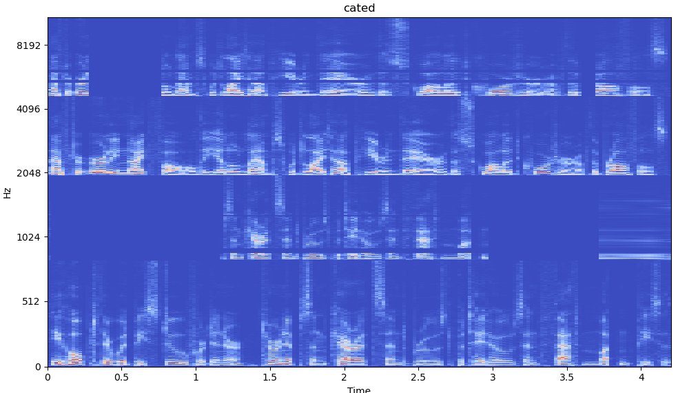

# SpecAugment [](https://opensource.org/licenses/Apache-2.0)
An implementation of SpecAugment for Pytorch

## How to use

Install pytorch, version>=1.9.0 (new feature (torch.Tensor.take_along_dim) is used.).


```python
import torch
from spec_augment_pytorch import SpecAugmentTorch
from spec_augment_pytorch import visualization_spectrogram
p = {'W':40, 'F':29, 'mF':2, 'T':50, 'p':1.0, 'mT':2, 'batch':False}
specaug_fn = SpecAugmentTorch(**p)

# [batch, c, frequency, n_frame], c=1 for magnitude or mel-spec, c=2 for complex stft
complex_stft = torch.randn(1, 1, 257, 150) 
complex_stft_aug = specaug_fn(complex_stft) # [b, c, f, t]
visualization_spectrogram(complex_stft_aug[0][0], "blabla")
```

run command `python spec_augment_pytorch.py` to generate examples (processed wav and visual spectrogram).
In test code, we using one of the [LibriSpeech dataset](http://www.openslr.org/12/).

<p align="center">
  
</p>


## Reference
[1] [DemisEom/SpecAugment](https://github.com/DemisEom/SpecAugment)

[2] [zcaceres/spec_augment issue17](https://github.com/zcaceres/spec_augment/issues/17)

[3] [SpecAugment: A Simple Data Augmentation Method for Automatic Speech Recognition](https://arxiv.org/pdf/1904.08779.pdf)